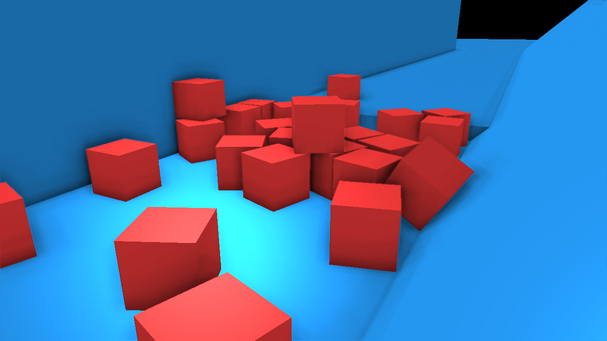

# Tarbora, The Game Engine for Makers

Check out the docs at https://solanspuig.github.io/Tarbora/html/index.html

Check out my Patreon at https://www.patreon.com/tarbora

## What is Tarbora?

Tarbora is an engine to create 3D games, mainly procedural generated role-playing games, like 3D roguelikes,
but also puzzle-solving games, shooters and e-sports.

## An Engine for Programmers

Tarbora has a different approach to level design and modeling tools. All the resources needed and all the editors
(that will be) provided are aimed to be easy to use for programmers, without the need to hire an artist or buy
expensive software at the first stages of development. That also speeds up the process of expanding your game or
creating mods!

## An Engine for Educators

Programming is the future. Your students can learn it in the classical, boring way, or by seeing their creations come to
life inside a game that then they can play with friends, and spend hours having fun perfecting each little
detail, tweaking their creations and learning how to do it better.

## An Engine for Innovation

Tarbora is highly modular. Artificial Intelligence can be plugged, tweaked and interchanged without having to stop the
simulation. Hardware can be connected through serial port to create new ways to interact with the game from real life.
A website can be also connected via HTTP to... Do some cool things? There are as many possibilities as your imagination
can conceive.

## An Engine that needs your help

Tarbora is still a work in progress, and it's far from having all the features described above finished and stable.
At the moment, I'm a solo developer building that engine, but you can help me. You can talk about Tarbora with your
friends. You can try to build a simple game with the tools that are already there (although you might have a hard time as
the documentation is not finished and things are prone to change...). And you can donate to help
me be able to spend more hours working in that project and maybe hire someone to help me.

## Gallery

### Early stages of development:

*Screen capture during the development of lighting and SSAO*
